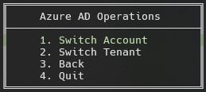
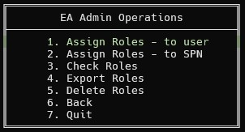
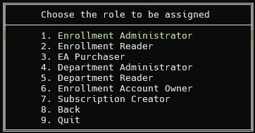
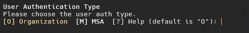
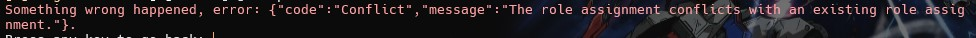
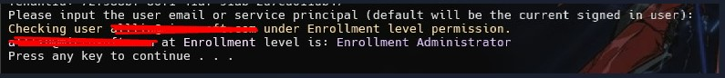
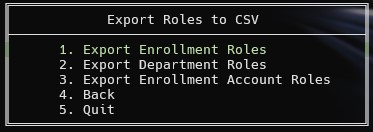
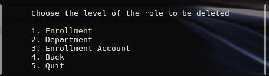
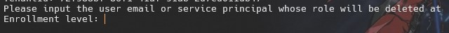
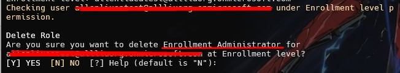

# Background of this tool

We have a lot of users who would like to use Azure Cost Management or Azure Billing APIs to do automation of the data analytics.

In that case, usually we will choose to use SPN as the caller to the API. To do that, first thing we need to do is to assign correct roles to the SPNs.

For Azure Enterprise Agreement users, this step has to be done by calling APIs, which is all under the hood.

Therefore, this tool is used to provide a "UI" to let the users to be able to automate the processes.

# How to use this tool

## Configuration

To make it easier and not to ask for too many user inputs, you have to fulfill some configurations before using this tool.

### Step 1: rename the configuraiton file

There is a file called `config.example.json` file, this is an example file that I provided for you to use.

Open a PowerShell window, `cd` to the script folder, and run command `cp config.example.json Configuration.json`.

With that, you will get a same file called `Configuration.json` which is the name used by default in the scripts.

### Step 2: fulfill the configuration file

If you would like to sign in with a SPN credentials, fulfill the below part:

```json
"SPLoginInfo": {
  "Client_Id": "",
  "Client_Password": "",
  "Tenant_Id": ""
},
```

If you need to login as a user credential, but with specific tenant, fulfill below part:

```json
"UserLoginInfo": {
  "Tenant_Id": ""
},
```

When you need to work on role based operations, fulfill the below part:

```json
"RoleOperationScope": {
  "BillingAccountName": "",
  "DepartmentName": "",
  "EnrollmentAccountName": ""
},
```

**Explanation: For Enterprise Agreement users, there are 3 different levels which is `Billing Account / Enrollment level`, `Department level` and `Enrollment Account level`. These roles are in a hierachy structure, however, some roles have specific permissions.**

**Therefore, when you assign or checking roles using this tool, there are also 3 levels scope you can get with, fulfill the necessary ones for you to use.**

## How to run the script

1. Open a PowerShell window. <br /> (Note: I strongly suggest to use PowerShell 7 which is this tool based on. There could be some compatibility issue if you are running PowerShell 5, feel free to create an issue if you encounter that and I will fix it.)
2. `cd` to the toolkit folder.
3. Run `.\EAAutomation.ps1`.

## Functionality

### Login

You can login with below methods:

1. Login with user credential.

   This will trigger Azure CLI user login process and will take the tenant id setting if you have set one.

2. Login with current user credential.

   If you can confirm that you have logged in before using Azure CLI (`az login` command in specific). Then you can skip the login and I will just use your current logged in credentials.

3. Login with SPN credential.

   To use this feature, you have to fulfill the **_SPLoginInfo_** in the configuraiton file to make it work.

   This will login as the SPN credential instead of the user credential.

A sample screenshot of the login is as below:

Pending screenshot.

## User Logged in features

### Azure AD Operations

When you logged in as a user credential, the first menu you can enter is **_Azure AD Operations_**, which provides below functionality:

1. Switch account

   This is used when you signed in to wrong account or you need to switch to an account with correct priviledge to do what you need to do.

   Examples:

   - You need to switch to `Enrollment Administrtor` role to assign another `Enrollment Administrator` role to the other users or SPNs.
   - You need to switch to an `Enrollment Account Owner` role to assign `Subscription Creator` role to the other users or SPNs.

2. Switch tenant

   This is used when you signed in to user credential with wrong tenant. This is very useful when you try to assign roles to SPNs since you have to sign in with the same tenant as the SPN.

A sample screenshot for that menu is as below:



### EA Admin Operations

This is currently the key feature of this toolkit.

**_It's strongly recommended to sign in as the `Enterprise Administrator` role to use the features in this menu._**

**_However, there is one exception here, when trying to assign `Subscription Creator` role, please make sure the user has the `Enrollment Account Owner` role._**

The sub menus for this feature is as below:



#### Assign Roles - to user

This is the feature for the current assigned user to assign roles to the other users.

The roles can be assigned to the users can be checked as below screenshot:



1. When you choose any role from the above screenshot, it will ask for the `user email address` which is the UPN for the user in the Azure Active Directory.

   

2. After inputing the user's email address, it will ask whether this user is an Work/School account (Organization) or Microsoft Account (MSA).

   

3. After choosing the user type, it will call the API to assign the corresponding role to the user.
4. If the role assignment is successful, it will display message regarding the role assignment success.

   

5. Otherwise, it will display whatever error is returned from the API call.

   

6. Please share the error to me or create a support ticket and share with the support engineer.

#### Assign Roles - to SPN

This is the same process as the assign to user, however, there are some differences:

1. The roles that can be assigned to a SPN are less, which includes `Enrollment Reader`, `EA Purchaser`, `Department Reader`, `Subscription Creator`.
2. You have to login the user as in the same tenant as the SPN.
3. There will be no choice for auth type like users, in specific, for choices on Organization or MSA.

For other steps, please consider the assign to users steps.

#### Check Roles

This feature is used to check a user or SPN's role on these 3 different levels.

- Enterprise level: The billing account level, including roles like `Enrollment Administrator/Reader`, `EA Purchaser`, etc.

  You need to fulfill the `BillingAccountName` in the configuration file to make it work.

- Department level: The department level, including `Department Administrator`, `Department Reader`.

  You need to fulfill the `DepartmentName` in the configuration file to make it work.

- Enrollment Account level: The enrollment account level, including `Enrollment Account Owner`, `Subscription Creator` roles.

  You need to fulfill the `EnrollmentAccountName` in the configuration file to make it work.

After selecting the level, it will ask for the `user email` / `SPN ID` to check the role for. After inputing, it will display the role of that user / SPN for the specific level.



#### Export Roles

Export roles is a functionality you can use to export all the role assignments for some specific level: like `Enterprise/Enrollment` level, `Department` level, or `Enrollment Account` level.

To have the widest range of the priviledge, I would suggest login as the `Enrollment Administrator` user and then use this feature.

After selecting this menu, you will be asked to choose a level for the exporting, as below screenshot:



After selecting the level, you will see a `csv` file genereated under the scripts folder.

You can check on the file and there will be `Assigned To` column indicating who has been assigned and `Role Definition Name` is the role that has been assigned to the user / SPN. There is also a column called `Assigned Type` which indicates whether it's a user or SPN.

#### Delete Roles

Deleting roles work similarly as assign roles. However, since per level you will only have one role by default.

For example, if the user has been assigned the `Enrollment Administrator` role, you will not be able to assign `Enrollment Reader` or `EA Purchaser` role to that user anymore since it's a conflict.

Therefore, when deleting a role, you won't be asked about which role to be deleted but which level the role is on that you need to delete.

Detailed steps:

1. Select which level you want the role to be deleted.

   

2. You will be asked to input the user email or SPN object id that.

   

3. The app will check the current role on that level and if there is any role on that level, you will be asked to confirm whether you want to delete the role for sure.

   Note: Your signed in user must be in the same tenant as the `SPN` when you try to delete a role for the SPN.

   

4. Once you choose Yes/Y, the role will be deleted and you should see a message indicating the successful deletion of the role.

# How to make feature requests

I haven't set up all the things like a project / issue templates for this tool.

Therefore, if you would like some feature requests that you feel it's very useful to others, please create an issue and mark the title with things like **_[Feature Request]_** and I will check on the requests and see if that's possible to merge into this tool.

# How to create bugs

Simply create an issue and indicating it's a bug.

# How to contribute

Pleaes follow the standard open-source flow, which is fork this repo and make a PR whenever you want to merge to this main repo.
